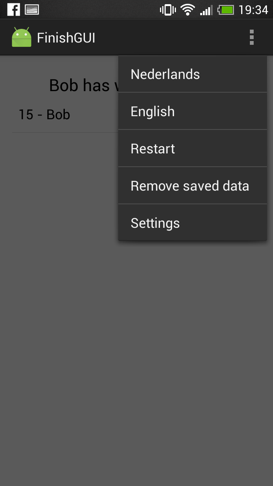

Ghost
=====
**Ghost** is a mobile game application for Android that provides a local multiplayer version of the game of Ghost.

GUI
---
The app will consist of only three activities.
  * **Welcome**.class
  * **GameGui**.class
  * **Finish**.class

*Welcome* asks for the player names with two text fields and a button, and handles the shared preferences concerning player names.
Previous games are shown in a drop down options menu. The names are then passed on as a bundle to *GameGui*,
where the actual game will be played.
*GameGui* consists of the TextView that shows the current word status, a text field,
which closes its keyboard after a character has been added, enables player input in combination with the submit button below it.
Turns are indicated by a small TextView stating the player's name, and the background color which changes along with the turns. As the game consists of multiple rounds, two rating bars will indicate the amount of lives left for each player.
*Game* also communicates with the back end to enable game progress.
When the back end notifies the activity about a won game, *GameGui* changes to *Finish*, which merely states the winner in a TextView and enables the players to replay using a button. It also shows a ranked list of high scores and allows the
user to scroll through them.

A menu bar on top of the app helds a settings menu consisting of
  * language selection
  * restart
Language differences are stored in strings xml files. The language selection is stored in the shared preferences and defaults
to english. The restart option restarts the entire app, throwing away all temporary data and returning to the *Welcome* activity.

Event listeners that ought to be changed are onStop() and onStart(). They save and load non finished games from the shared preferences.

Back end
--------
The back end is based on two java classes called **Game**.class and **Lexicon**. *Game* keeps track of all game data and provides public methods
for game progression. After initializing a *Game* object, providing player names, a move can be made by calling *guess()*.
~~~java
Ghost game = Ghost();
String message = game.move(String move);
if(!message.equals("OK")) {
    System.out.println(message);
}
~~~
The *guess()* function checks the input on both syntaxical and game related rules, and changes the game state if everything is valid. If not, it returns a message stating the problem.

Impressions
-----------

